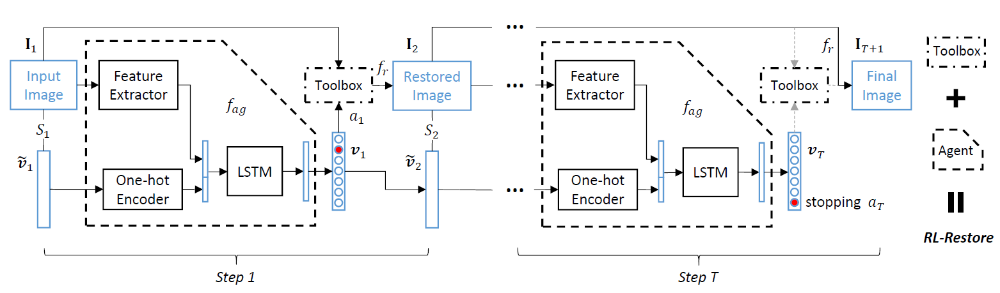
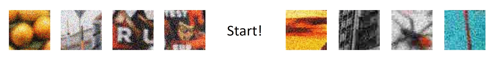
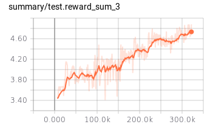

## RL-Restore [[project page](http://mmlab.ie.cuhk.edu.hk/projects/RL-Restore/)][[paper](https://arxiv.org/abs/1804.03312)]
We have run our code under following settings:<br/>
Python 2.7/3.5<br/>
[TensorFlow](https://www.tensorflow.org/) 1.3/1.4<br/>
CUDA 8.0<br/>
cuDNN 5.1

:triangular_flag_on_post: Add Python3 compatibility. Aug 6<br/>
:triangular_flag_on_post: Training code is ready! Jun 15

### Overview

- Framework


- Results


### Test
- Start testing
    ```
    python main.py --dataset moderate
    ```
    > `dataset`: choose a test set among `mild`, `moderate` and `severe`

- Dataset

    - All test sets can be downloaded at [Google Drive](https://drive.google.com/open?id=19z2s1e3zT8_1J9ZtsCOrzUSsrQahuINo) or [Baidu Cloud](https://pan.baidu.com/s/1RXTcfI-mne5YZh3myQcjzQ).

    - Replace `test_images/` with the downloaded data and play with the whole dataset.

- Naming rules

    - Each saved image name refers to a selected toolchain. Please refer to this [issue](https://github.com/yuke93/RL-Restore/issues/1).

### Train
- Download training images
    - Download training images (down-sampled DIV2K images) at [Google Drive](https://drive.google.com/file/d/146mmYHcZeWnklQ_Sg7ltCrJVqjL_yB3K/view?usp=sharing) or [Baidu Cloud](https://pan.baidu.com/s/1CD-E5dUMsMswvCVQhe5PeQ).

    - Move the downloaded file to `data/train/` and unzip.

-  Generate training data
    - Run `data/train/generate_train.m` to generate training data in HDF5 format.

    - You may generate multiple `.h5` files in `data/train/`

- Let's train!

    ```
    python main.py --is_train True
    ```

    - When you observe `reward_sum` is increasing, it indicates training is going well.

    - You can visualize reward increasing by TensorBoard.

    

### Acknowledgement
The DQN algorithm is modified from [DQN-tensorflow](https://github.com/devsisters/DQN-tensorflow).

### Citation

    @inproceedings{yu2018crafting,
     author = {Ke Yu, Chao Dong, Liang Lin, and Chen Change Loy},
     title = {Crafting a Toolchain for Image Restoration by Deep Reinforcement Learning},
     booktitle = {Proceedings of IEEE Conference on Computer Vision and Pattern Recognition (CVPR)},
     month = {June},
     year = {2018} 
    }
